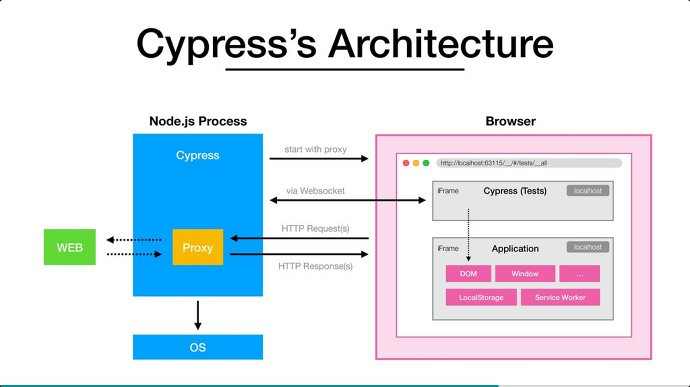

# Module 1

## Cypress Introduction

**What is Cypress?**  
Cypress is a next generation frontend automation testing tool build for the mordern web application.

**How Cypress is Unique from other automation tools?**

- Cypress automatically waits for commands and assertations before moving on. No more async hell.  
  Ex: If a link button is disabled. And get clickable after few seconds. Cypress wait to check for it to get enabled to check.  
  Default timeout is of 4 seconds. But it can be manually increase or decrease.

- Ability to test edge test cases by mocking the server response.

- Cypress takes snapshot as the tests run.

- Because of it architecture design, Cypress delivers fast, consistent and reliable test execution compared to other Automation tools.

- View video of the entire tests execution when run from the Cypress Dashboard.

**_Few things:_**  
Cypress is built on Node.js and comes packed as an npm module.  
As it is built on Node.js, it uses Javascript for writing test cases. But 90% of code is cypress inbuilt commands.  
Cypress also bundles with jQuery and inherits many of its methods for UI components identification.

## Cypress Architecture

Most testing tools (like Selenium) operate by running outside of the browser and executing remote commands across the network. But Cypress engine directly operates inside the browser. In other words, is the browser that is executing your test code.

This enables Cypress to listen and modify the browser behavior at run time by manipulating DOM and altering Network requests and responses on the fly.

Cypress open doors to New Kind of testing (unit testing, integration test, e2e testing, etc) with Having ultimate control over your application (front and back).

**Cypress Browser Support**

- Chrome
- Electron
- Firefox
- IE

**Cypress Components**

- Test Runner
- Dashboard Service
